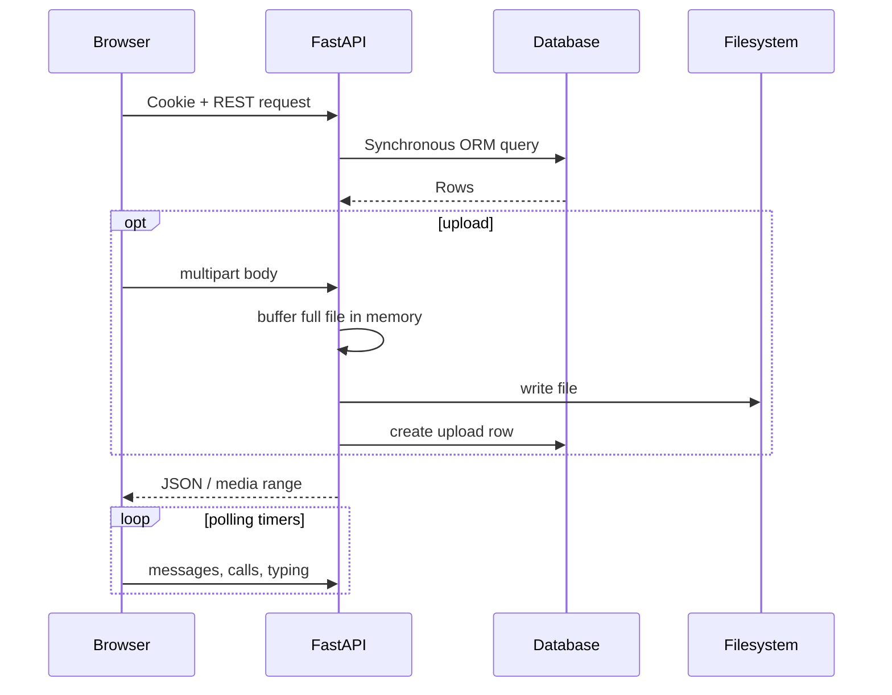

# Технический аудит исходного Onix Messenger

## Резюме

Проект — монолитный FastAPI-сервер с синхронным SQLAlchemy, большим безмодульным браузерным клиентом и PostgreSQL/SQLite. Интерфейс богатый: личные/сохранённые чаты, группы, каналы, PIN/magic-link/password auth, файлы, голосовые, изображения/видео, реакции, закрепления, звонки, push, privacy, premium/payments, reports/admin, guest links, tags и multi-device sync. Функции реализованы, но архитектура рассчитана на один процесс и частый HTTP polling; это главный предел производительности и масштабирования.

## Компоненты и потоки данных

| Компонент | Реализация | Данные/протокол |
|---|---|---|
| Клиент | HTML + 8 JS + 18 CSS | Fetch/FormData, localStorage, Service Worker, MediaRecorder, WebRTC signalling polling |
| API | FastAPI/Uvicorn | JSON REST `/api/v2`, legacy form/JSON `/api/*.php` |
| Auth | signed cookie + server session row | bcrypt/argon2 verification, PIN, recovery, magic/reset tokens |
| DB | SQLAlchemy/Alembic | PostgreSQL production, SQLite fallback, 34 модели |
| Realtime | process-local WebSocket manager | фактический клиент в основном polling; межпроцессного bus нет |
| Files | local filesystem | authenticated routes, Range через FileResponse |
| Cache/rate limit | memory or optional Redis | fixed minute windows |
| Email | console/SMTP | verification/reset/magic links |
| Operations | Docker Compose, shell backup/restore | PostgreSQL volume + local storage |

## Зависимости

### Python

FastAPI 0.115.6, Uvicorn 0.34.0, python-multipart 0.0.20, SQLAlchemy 2.0.36, Alembic 1.14.0, psycopg2-binary 2.9.10, PyMySQL 1.1.1, passlib 1.7.4, bcrypt 4.2.1, PyJWT 2.10.1, argon2-cffi 23.1.0, Pydantic 2.10.4, pydantic-settings 2.7.0, aiosmtplib 3.0.2, redis 5.2.1, python-dotenv 1.0.1, itsdangerous 2.2.0, httpx 0.28.1, pytest 8.3.4, pytest-asyncio 0.25.0.

### Runtime/infrastructure

Python base image `onix-python-base:local`, PostgreSQL 16 Alpine, Redis 7 Alpine, Docker Compose, nginx example, Windows batch launcher, POSIX backup/restore scripts. Клиент не использует package manager; библиотеки включены непосредственно в исходный JS/CSS.

## Подтверждённые дефекты

### Критические/высокие

1. **Запуск Docker не воспроизводим.** Dockerfile начинается с локального `onix-python-base:local`, который должен создавать отсутствующий `start.sh`. В архиве есть только `OPEN_ONIX_MESSENGER.bat` и `DEMO_PREVIEW.bat`; compose без заранее созданного image не собирается.
2. **Небезопасные development defaults.** `APP_DEBUG=true`, известный development secret и console email backend включены по умолчанию. Ошибка production-настройки может раскрывать коды/ссылки и ослабить cookie/CORS.
3. **XSS blast radius.** Клиент содержит большое число `innerHTML`/`insertAdjacentHTML`, CSP допускает `'unsafe-inline'` для scripts/styles. Есть `escapeHtml`, но безопасность зависит от дисциплины каждого из сотен шаблонов; одна пропущенная ветка даёт stored XSS через сообщение/имя/metadata.
4. **CSRF защита неполная.** Проверяются Origin/Referer только в production, а отсутствие обоих заголовков разрешается. Нет отдельного anti-CSRF token. SameSite=Lax снижает, но не закрывает весь класс атак и сценарии с ошибочно разрешённым origin.
5. **Rate-limit обходится spoofing’ом.** `X-Forwarded-For` принимается без списка доверенных reverse proxies. Клиент может менять заголовок и обходить login/register/reset limits, а audit IP становится недостоверным.
6. **Нет E2EE.** TLS может защищать транспорт, но сервер хранит доступный plaintext сообщений/metadata. Заявлять end-to-end encryption нельзя.

### Средние

7. Все FastAPI handlers объявлены `async`, но используют синхронные SQLAlchemy Session/psycopg2/redis calls. Под нагрузкой они блокируют event loop и увеличивают p95/p99 latency.
8. Uvicorn запускается с `--workers 1`; WebSocket manager и rate limit находятся в памяти процесса. Увеличение workers нарушит согласованность realtime без Redis bus.
9. Клиент запускает несколько постоянных `setInterval`/`setTimeout` и polling loops для сообщений, звонков, premium и typing. В фоне это создаёт лишние wakeups, запросы и задержку до следующего poll.
10. Upload сначала полностью накапливается в `bytearray`, затем пишется на диск. Несколько одновременных файлов дают пиковую память примерно `concurrency × max_upload_size` плюс копии.
11. MIME/content validation эвристическая. Проверка расширения, заявленного MIME и нескольких magic bytes не заменяет строгий allowlist/decoder validation/антивирусную обработку.
12. `Content-Disposition` формируется из исходного имени файла вручную. Имя должно кодироваться по RFC 5987 и исключать CR/LF/кавычки независимо от поведения framework.
13. Redis используется как optional best-effort fallback. При ошибке сервис тихо возвращается к process-local лимитам; в кластере политика безопасности становится неодинаковой.
14. Статика получает `no-store`, включая крупные изображения/CSS/JS. Это заметно замедляет повторный запуск и увеличивает сеть/CPU. Нужны hashed assets + immutable cache, а HTML — no-cache.
15. Main JS (1.1 MiB, 26k строк) и CSS (0.5 MiB, 20k строк) монолитны; множество поздних fix-файлов переопределяют одни и те же селекторы/handlers. Высок риск regressions, повторных listeners и layout recalculation.
16. Глобальный exception handler скрывает детали от клиента правильно, но отсутствуют request/correlation ID и структурированные fields, что усложняет расследование задержек и ошибок.
17. Cleanup/maintenance выполняется в процессе приложения. При нескольких replicas работа дублируется; без distributed lock возможны гонки удаления orphan/expired данных.
18. Backup/restore привязаны к именам контейнеров/локальному layout; нет manifest/version/checksum и атомарного rollback.

### Низкие/поддерживаемость

19. Зависимости закреплены, но отсутствует hash-lock уровня `pip --require-hashes`/SBOM; `requirements.lock` является обычным списком версий.
20. Нет CI workflow, линтинга, type checking, SAST, dependency scanning и автоматического browser E2E.
21. Большая часть функций тестируется только core integration suite; нет тестов конкурентного pin/react/send, fuzz upload names, WebSocket backpressure, backup restore и migration downgrade.
22. Legacy PHP-compatible API удваивает поверхность и ветвление payload parsing.
23. `init_db` содержит ручные ALTER fallback рядом с Alembic, создавая две конкурирующие схемы миграции.

## Классы уязвимостей

| Класс | Результат |
|---|---|
| SQL injection | прямой подтверждённой инъекции не найдено: ORM и константные `text()`; wildcard search параметризован |
| XSS | высокий системный риск из-за массового HTML templating + unsafe-inline; требуется sink-by-sink DOM тест |
| CSRF | частичная защита, отсутствие token и allow-on-missing-origin |
| RCE | прямого `eval/subprocess/os.system/pickle/yaml.load` в backend не найдено |
| Path traversal | storage names генерируются сервером и resolve checks присутствуют; нужны fuzz/Windows path tests |
| SSRF | пользовательские URL сервером напрямую почти не загружаются; push endpoints лишь сохраняются |
| IDOR | основные message/upload routes проверяют membership; все 126 routes требуют отдельного authorization matrix test |
| Brute force | лимиты есть, но proxy spoofing и process-local fallback ослабляют их |
| Session theft | HttpOnly/Secure в prod есть; CSP/XSS риск остаётся, токены должны ротироваться и быть opaque |

## Гонки, deadlock, утечки

- Явный deadlock статически не подтверждён.
- Process-local WebSocket maps должны быть защищены lock; даже при корректном lock возможны медленные consumer queues и зависшие connections без bounded backpressure.
- check-then-insert для username/private conversation/membership/reaction может конфликтовать параллельно; unique constraints превращают это в 500 без обработки `IntegrityError` или требуют retry/upsert.
- Одновременные edit/delete/pin/react/message-send не используют явную version column, поэтому возможен lost update.
- Object URLs и MediaRecorder/stream tracks должны закрываться на всех UI paths; большое количество обработчиков и перерисовок повышает риск retaining DOM/Blob references.
- Таймеры создаются в нескольких участках одного глобального файла; повторная инициализация может дублировать polling/listeners.

## Причины производительности

| Симптом | Наиболее вероятная причина |
|---|---|
| долгий первый запуск | no-store для всех assets, 1.1 MiB JS + 0.5 MiB CSS, много override-файлов |
| задержка сообщений | polling interval, sync DB в event loop, N+1 payload queries, один worker |
| высокий CPU клиента | несколько intervals, массовый DOM innerHTML, большие CSS cascade/layout |
| высокий CPU сервера | повторные list/poll queries, сериализация крупных conversation payloads |
| высокая память | full-buffer uploads, большие message lists, blob URLs/media buffers |
| зависание UI | синхронная обработка большого main JS, крупные render templates, media callbacks |
| плохое масштабирование | process-local realtime/rate limit/maintenance, local files, один worker |

## Что проверено автоматически

- Все 168 путей перечислены; SHA-256 рассчитан для каждого файла.
- MIME-типы всех ресурсов классифицированы.
- Все 59 Python-файлов прошли `compileall`.
- Все 8 JS-файлов прошли `node --check`.
- Из AST извлечены 126 routes, 34 models и 44 request schemas.
- Штатный pytest не выполнен: в исходном окружении отсутствуют зависимости. Это не считается успешным тестом.
- Go build/race пока не выполнены: Go отсутствует в текущей Linux-среде; `start.bat` выполняет их после проверенной установки на Windows.

