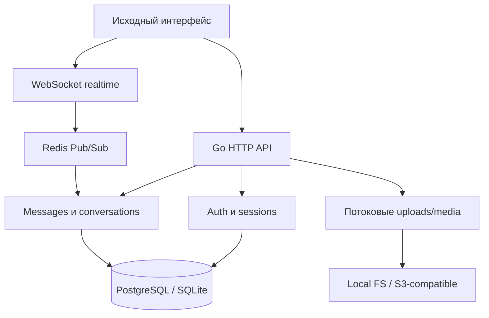

# План миграции Onix Messenger на Go

## Зафиксированный объём

- 168 файлов исходного архива исследованы и захешированы.
- 59 Python-модулей, 34 ORM-модели, 44 схемы запросов и 126 HTTP-маршрутов.
- 8 JavaScript-файлов и 18 CSS-файлов; основной клиент — 26 273 строки JS и 20 731 строка CSS.
- 12 Alembic-миграций, PostgreSQL/SQLite, необязательные Redis и SMTP.
- 60 PNG, 2 SVG, 2 OGG и 1 JPEG проверены как отдельные ресурсы.

## Решение по интерфейсу

Основной продукт остаётся браузерным приложением. Текущий HTML/CSS/JS встраивается в Go-бинарник без визуальной переработки. Это единственный вариант, который сохраняет DOM, CSS-каскад, анимации, сочетания клавиш, медиазапись, Service Worker и поведение мобильной вёрстки без расхождения.

| Вариант | Сохранение UI | Web | Desktop | Решение |
|---|---:|---:|---:|---|
| Встроенный web-клиент + Go HTTP | точное | да | через браузер/PWA | основной |
| Wails | точное | нет | да | дополнительная оболочка после web-релиза |
| Fyne | низкое | ограниченно | да | отклонён: интерфейс пришлось бы рисовать заново |
| Gio | низкое | WASM возможно | да | отклонён: другой rendering/input model |
| WebView | высокое | нет | да | возможен как минимальная оболочка |

## Целевая архитектура

## Этапы и критерии приёмки

### 0. Инвентаризация — завершён

- Реестр и SHA-256 каждого файла.
- AST-каталог маршрутов, моделей и схем.
- Синтаксическая проверка всех Python/JS-файлов.
- Анализ запуска, Docker, backup/restore, сетевых вызовов и медиа.

### 1. Go-каркас и неизменный UI — завершён

- Один Go-процесс, встроенная статика, таймауты, structured logging, panic recovery, graceful shutdown.
- `start.bat` устанавливает официальный Go, проверяет SHA-256, создаёт конфигурацию, тестирует, собирает и запускает.
- Веб-предпросмотр использует те же клиентские файлы.

### 2. Данные и миграция — следующий

- SQL-миграции, полностью эквивалентные Alembic 0001–0012.
- Репозитории с транзакциями и optimistic/pessimistic locking там, где это требуется.
- Импорт существующего PostgreSQL/SQLite без изменения идентификаторов и временных меток.
- Acceptance: сравнение количества строк и контрольных выборок по всем 34 сущностям.

### 3. Авторизация и безопасность

- Регистрация, email verification, password reset, magic link, PIN/recovery word, devices, logout/revocation.
- Argon2id для новых паролей; прозрачная проверка и upgrade существующих bcrypt-хешей.
- Opaque sessions в БД/Redis; cookies Secure, HttpOnly, SameSite=Lax; CSRF-token для мутаций.
- Acceptance: полное соответствие контракту `/api/v2` и legacy `/api/*.php`.

### 4. Сообщения, контакты и сообщества

- Private/saved/group/channel; роли, membership, privacy, block, pins, reactions, edit/delete/forward/read/typing.
- Транзакционная запись message + attachment + event + unread state.
- Acceptance: перенос и расширение всех `test_core_flows.py` в table-driven Go tests.

### 5. Realtime, звонки и уведомления

- WebSocket с origin/auth checks, backpressure, bounded queues, ping/pong и reconnect cursor.
- Redis Pub/Sub для нескольких экземпляров; polling остаётся совместимым fallback.
- WebRTC signalling, push subscription registry и in-app events.

### 6. Файлы и медиа

- Потоковая запись с лимитом размера; MIME sniffing; allowlist; случайные имена; atomic rename.
- Range/conditional requests, проверка доступа, orphan cleanup, аватары, voice, изображения, видео, receipts.
- Опциональное S3-compatible хранилище без изменения публичного API.

### 7. Остальные функции

- Payments/entitlements, reports/admin, support bot, advanced preferences, tags, sync, guest links, view-once.
- Backup/restore и миграция существующих каталогов.

### 8. Нагрузочный и повторный аудит

- `go test -race ./...`, fuzzing декодеров, staticcheck, govulncheck, gosec.
- Профили CPU/heap/goroutines, 1k/10k concurrent WebSocket sessions, большие upload/range tests.
- Chaos tests Redis/DB/storage, graceful shutdown и restart recovery.

## Неоднозначности, которые нельзя решать молча

1. Целевой GitHub-репозиторий отсутствует в архиве — нужен точный `owner/name`.
2. Production URL, SMTP, Redis и PostgreSQL credentials не заданы.
3. E2EE в исходнике отсутствует. Добавление настоящего end-to-end encryption изменит протокол и миграцию устройств; это отдельное продуктовое решение.
4. Sites годится для интерфейсного preview, но stateful Go server, PostgreSQL, WebSocket и файлы должны развёртываться отдельно.

